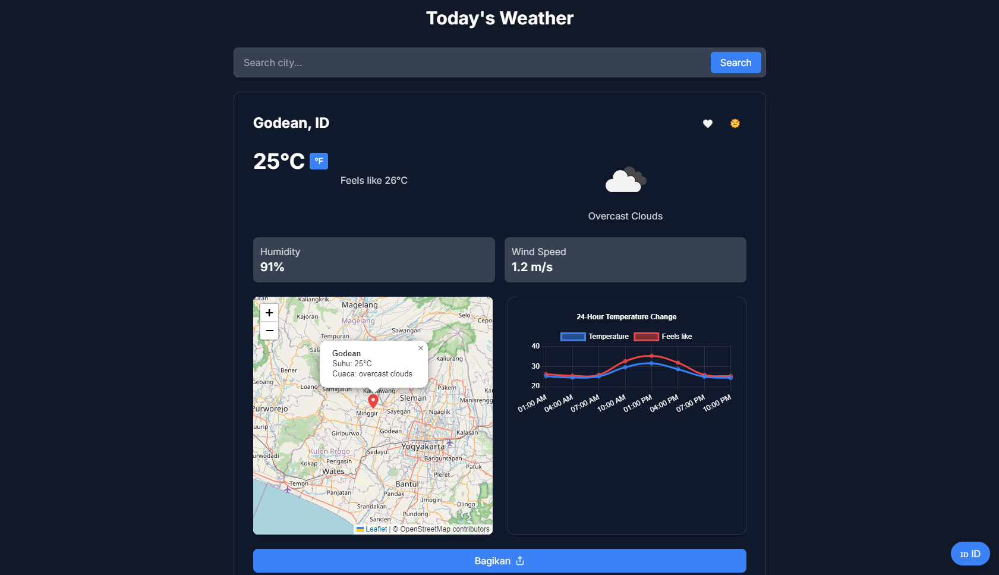
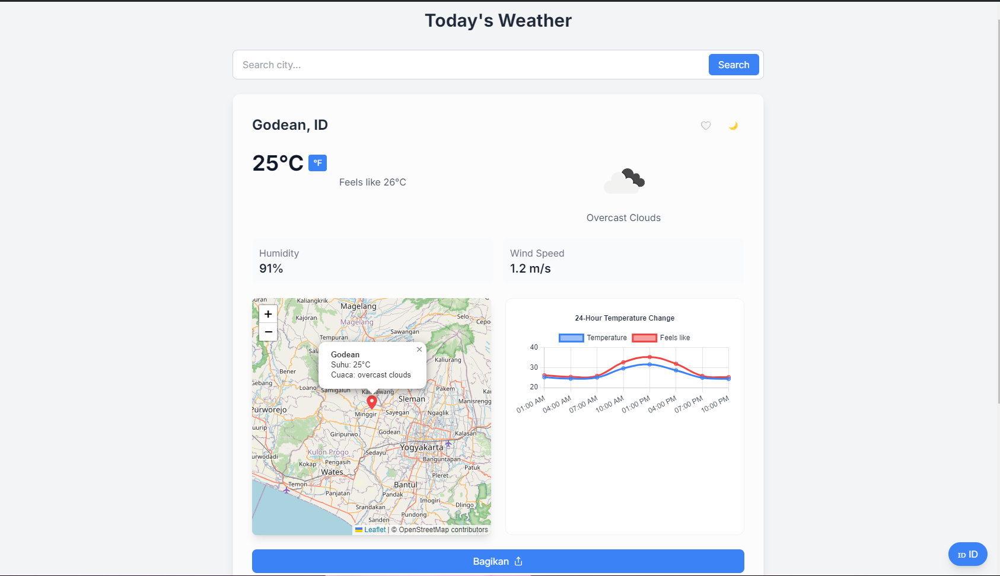
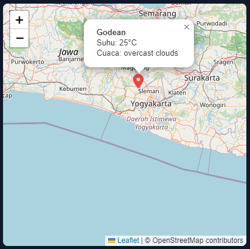
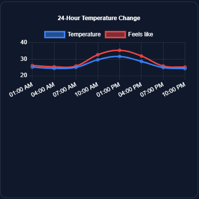

# Modern Weather App

A modern weather application with real-time updates, 5-day forecast, and interactive maps. Built with Next.js 14, TypeScript, and Tailwind CSS.

[🇮🇩 Baca dalam Bahasa Indonesia](#indonesian)



## ✨ Features

- 🌡️ Real-time weather information
- 🗺️ Interactive weather map
- 📊 24-hour temperature change graph
- 🌅 Dark/Light mode
- 🌍 Multi-language support (EN/ID)
- 📱 PWA support
- 🔔 Extreme weather notifications
- ❤️ Save favorite cities
- 🔄 Unit converter (Celsius/Fahrenheit)
- 📤 Share feature

## 🚀 Demo

Visit: [weather-app-demo.vercel.app](https://weather-app-demo.vercel.app)

## 🛠️ Built With

- Next.js 14
- TypeScript
- Tailwind CSS
- React Query
- Zustand
- Leaflet Maps
- Chart.js
- Framer Motion

## ⚙️ Installation

1. Clone the repository
```bash
git clone https://github.com/enowdev/weather-webapp.git
cd weather-webapp
```

2. Install dependencies
```bash
npm install
# or
yarn install
```

3. Set up environment variables
```bash
cp .env.example .env.local
```

Add to `.env.local`:
```
NEXT_PUBLIC_OPENWEATHER_API_KEY=your_api_key_here
```

4. Run the development server
```bash
npm run dev
# or
yarn dev
```

Open [http://localhost:3000](http://localhost:3000) in your browser.

## 🚀 Deployment

### Deploy on Vercel

[](https://vercel.com/new/clone?repository-url=https://github.com/enowdev/weather-webapp)

### Deploy on Netlify

[](https://app.netlify.com/start/deploy?repository=https://github.com/enowdev/weather-webapp)

## 📸 Screenshots

### Light Mode


### Dark Mode


### Interactive Map


### Temperature Chart


## 📝 License

This project is licensed under the MIT License - see the [LICENSE](LICENSE) file for details.

## 📧 Contact

enowdev - [@enowdev](https://twitter.com/enowdev)

Project Link: [https://github.com/enowdev/weather-webapp](https://github.com/enowdev/weather-webapp)

---

<a name="indonesian"></a>
# Aplikasi Cuaca Modern

Aplikasi cuaca modern dengan fitur real-time, prakiraan 5 hari, dan peta interaktif. Dibangun dengan Next.js 14, TypeScript, dan Tailwind CSS.

[🇬🇧 Read in English](#top)

## ✨ Fitur

- 🌡️ Informasi cuaca real-time
- 🗺️ Peta cuaca interaktif
- 📊 Grafik perubahan suhu 24 jam
- 🌅 Mode gelap/terang
- 🌍 Multi-bahasa (ID/EN)
- 📱 Dukungan PWA
- 🔔 Notifikasi cuaca ekstrem
- ❤️ Simpan kota favorit
- 🔄 Pengubah unit (Celsius/Fahrenheit)
- 📤 Fitur berbagi

## 🛠️ Dibuat Dengan

- Next.js 14
- TypeScript
- Tailwind CSS
- React Query
- Zustand
- Leaflet Maps
- Chart.js
- Framer Motion

## ⚙️ Instalasi

1. Clone repository
```bash
git clone https://github.com/enowdev/weather-webapp.git
cd weather-webapp
```

2. Install dependensi
```bash
npm install
# atau
yarn install
```

3. Siapkan environment variables
```bash
cp .env.example .env.local
```

Tambahkan ke `.env.local`:
```
NEXT_PUBLIC_OPENWEATHER_API_KEY=your_api_key_here
```

4. Jalankan server development
```bash
npm run dev
# atau
yarn dev
```

Buka [http://localhost:3000](http://localhost:3000) di browser Anda.

## 📝 Lisensi

Proyek ini dilisensikan di bawah Lisensi MIT - lihat file [LICENSE](LICENSE) untuk detail.

## 📧 Kontak

Nama Anda - [@twitter_handle](https://twitter.com/twitter_handle)

Link Proyek: [https://github.com/enowdev/weather-webapp](https://github.com/enowdev/weather-webapp)
